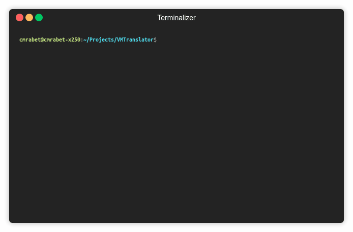

# Hack Virtual Machine Compiler

## Introduction

This is a compiler for HACK computers that converts Virtual Machine byte code into ASM code.

I made this program as part of the Nand2Tetris course.

## Usage

The compiler can process single `.vm` files or entire directories containing `.vm` files.

Use as follows:

`VMTranslator <dirname> -c`
`VMTranslator <filename> -c`

Where `-c` when provided, will include comments in the generated ASm file.

The compiler will generate one single `.asm` file, named after the provided file or directory, containing the generated ASM code.

